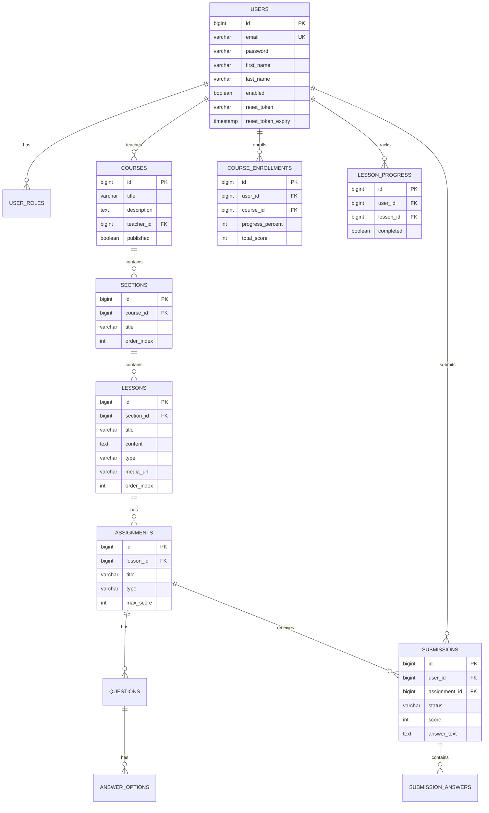

# VioletBloom — Веб-приложение для онлайн-курсов

Учебный проект: полноценная платформа онлайн-обучения на **Java / Spring Boot** с акцентом на архитектуру, оптимизацию БД и безопасность.

## Требования

- **Java 21** (JDK)
- **Maven 3.9+**
- **Docker Desktop** — только для запуска через Docker / PostgreSQL (опционально)

## Технологии

| Категория | Стек |
|-----------|------|
| Backend | Spring Boot 3.3, Spring MVC, Spring Security |
| ORM | Hibernate / JPA, Spring Data JPA Auditing |
| БД | PostgreSQL 16, Liquibase |
| Маппинг | MapStruct, Lombok |
| Кэш | Spring Cache + Caffeine |
| Frontend | Thymeleaf, CSS |
| Тесты | JUnit 5, Mockito, Spring Boot Test (H2) |
| DevOps | Docker, Docker Compose |

## Архитектура

Многослойная архитектура с разделением ответственности:

```
Controller → Service → Repository → PostgreSQL
                ↓
            MapStruct (Entity ↔ DTO)
```

- **Controller** — HTTP-запросы, Thymeleaf-страницы
- **Service** — бизнес-логика, транзакции (`@Transactional`)
- **Repository** — доступ к данным, `@EntityGraph`, JOIN-запросы
- **Entity** — JPA-сущности с аудитом (`@CreatedDate`, `@LastModifiedBy`)

## ER-диаграмма базы данных



## Функциональность

- Регистрация, авторизация, восстановление пароля
- Роли: **STUDENT**, **TEACHER**, **ADMIN**
- CRUD курсов, разделов, уроков (текст, видео, аудио, презентация)
- Задания: тесты (автопроверка) и практические работы (ручная проверка)
- Прогресс студента: уроки, баллы, процент прохождения
- Статистика: личная для студентов, аналитика для преподавателей

## Оптимизации БД

- Нормализованная схема с индексами на FK и часто используемых полях
- `@EntityGraph` и `@Fetch(SUBSELECT)` для избежания N+1
- Пагинация (`Pageable`) для списков курсов
- JOIN и подзапросы для статистики популярности и успеваемости
- Spring Cache для каталога и деталей курсов
- Batch-настройки Hibernate (`jdbc.batch_size`)

## Инструкция по запуску

### Способ 1 — Быстрый (рекомендуется, без Docker)

Встроенная БД H2, демо-данные подставляются автоматически.

```powershell
cd online-courses
mvn spring-boot:run "-Dspring-boot.run.profiles=local"
```

Дождитесь строки `Started OnlineCoursesApplication`, затем откройте: **http://localhost:8080**

Остановка: `Ctrl+C` в терминале.

---

### Способ 2 — Полный стек через Docker

PostgreSQL + приложение + MailHog (для писем восстановления пароля).

```powershell
# Убедитесь, что Docker Desktop запущен (статус Running)
cd online-courses
docker-compose up --build
```

| Сервис | URL |
|--------|-----|
| Приложение | http://localhost:8080 |
| MailHog (почта) | http://localhost:8025 |

Остановка: `Ctrl+C` или `docker-compose down`

---

### Способ 3 — PostgreSQL в Docker, приложение локально

```powershell
cd online-courses
docker-compose up postgres mailhog -d
mvn spring-boot:run
```

Используется PostgreSQL из `docker-compose.yml` и миграции Liquibase.

---

# Способ 4 (ВОТ ПРЯМ ЖЕЛЕЗНЫЙ)
```powershell
cd online-courses
mvn clean package -DskipTests
java -jar target\online-courses-1.0.0.jar --spring.profiles.active=local
```

### Сборка JAR

```powershell
cd online-courses
mvn clean package -DskipTests
java -jar target/online-courses-1.0.0.jar
```

Для профиля `local` добавьте: `--spring.profiles.active=local`

## Демо-аккаунты

| Email | Пароль | Роль |
|-------|--------|------|
| student@courses.ru | password | Студент |
| teacher@courses.ru | password | Преподаватель |
| admin@courses.ru | password | Админ + Преподаватель |

## Тесты

```bash
mvn test
```

- **Unit-тесты** — `UserServiceTest`, `ProgressServiceTest` (Mockito)
- **Интеграционные** — `CourseIntegrationTest` (Spring Boot + H2 in-memory)

## Структура проекта

```
src/main/java/com/courses/
├── config/          # Security, Cache, JPA Auditing
├── controller/      # MVC-контроллеры
├── dto/             # Data Transfer Objects
├── entity/          # JPA-сущности
├── exception/       # Обработка ошибок
├── mapper/          # MapStruct-мапперы
├── repository/      # Spring Data JPA
├── security/        # UserDetails, SecurityUtils
└── service/         # Бизнес-логика
```